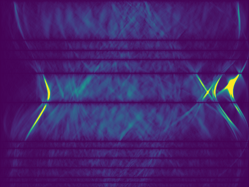
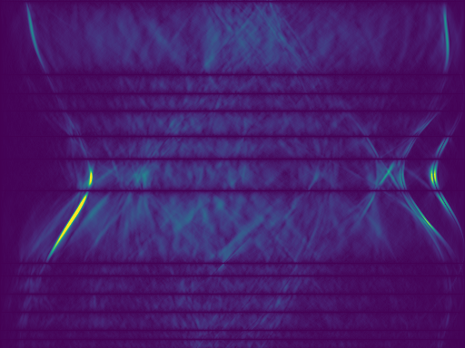

<h1 align="center">Sparse Computed Tomography Reconstruction using Conditional Diffusion Models</h1>

<p align="center">
  
  
</p>

## Installation

1. Install LEAP

```shell
cd LEAP
pip install -e .
cd ..
```
2. Install dependencies
```shell
pip install -r requirements.txt
```

3. Install the diffusion package
```shell
# -e if you plan to make changes, otherwise installing without -e is fine.
pip install -e . 
```
## Datasets

KiTS: https://www.cancerimagingarchive.net/collection/c4kc-kits/

fastMRI: https://fastmri.med.nyu.edu/

The scripts mentioned below can be used to create the training and test splits in safetensors format for the given datasets.
```shell
# KITS
# splits data into train and test
python scripts/kits_to_safetensors.py --kits_root_dir="{{download_directory}}" --target_dir="{{output_directory}}" --train_fraction=0.8

# fastMRI
# already is split, run this twice, once for desired train, and once for desired test split
python scripts/mri_to_safetensors.py --mri_root_dir="{{download_directory}}" --target_dir="{{output_directory}}" --split={{"train"|"test"}}

# CHIP
# splits tiff images into smaller patches, creates train and test splits
python scripts/tiff_to_safetensors.py --tiff_directory="{{download_directory}}" --path_directory="{{output_directory}}" --path_size=512 --overlap=100
```

### Test sample:
data/kits and data/chip contain 30 images from the test split each to run this code without downloading the full datasets.

## Run code
```shell
# usage example in conditional_diffusion.py and active_learning.py comments

# basic unconditional diffusion training example:
python conditional_diffusion.py --project="{{project_name}}" --run="{{run_name}}" --output_dir="{{output_dir}}" --dataset_dir="{{dataset_dir}}" train
```

